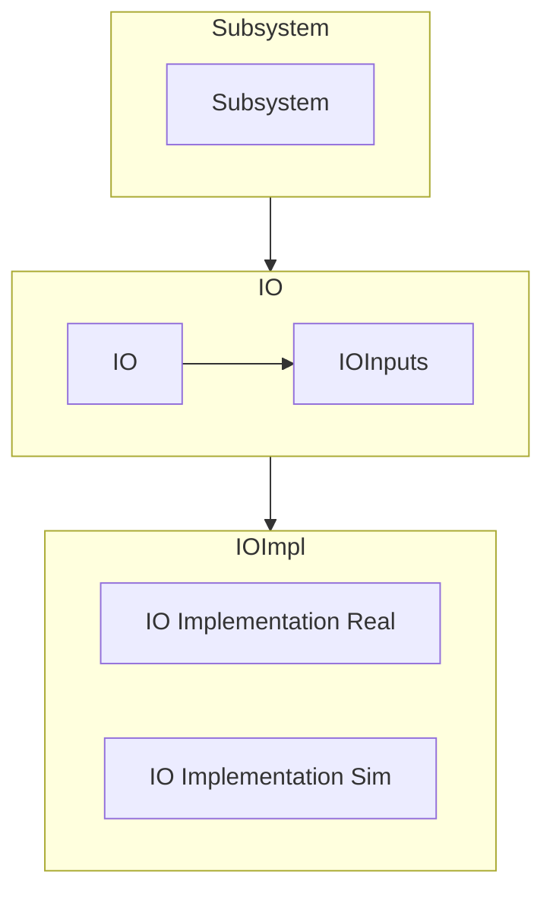
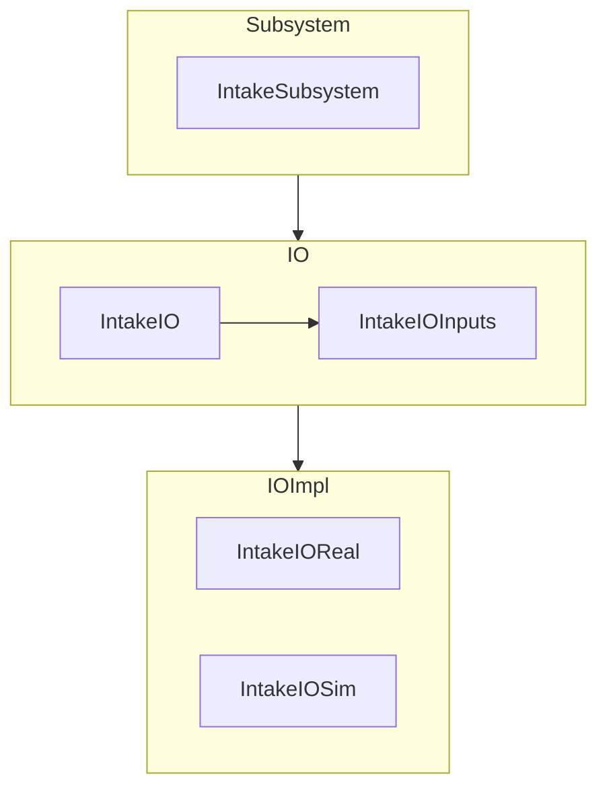
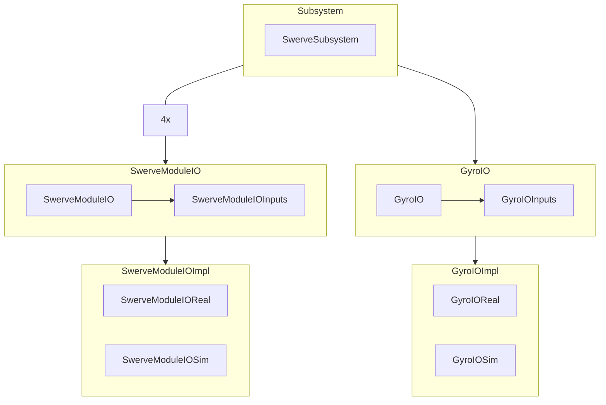

# AdvantageKit Code Structure Reference

This document contains a quick reference for how we structure our code.
It should be used when planning out the structure of a subsystem.

## Basic Layout



This diagram shows the basic structure of an AKit Subsystem.
It includes 3 layers:

### Subsystem

- The "subsystem" layer is a class which extends `SubsystemBase`.
- This class should contain methods that return Commands for this subsystem.
- This class should contain all higher-level control flow within this mechanism.
  - For instance, it could contain a `SwerveDriveOdometry` object to track a drivetrain's position.
  - It might contain information about the current target of a mechanism, or whether or not the mechanism has homed its position yet.
  - Generally, this information should all be "processed" information that we derive from our IOInputs.
- The `Subsystem` file will contain one `IO` instance and one `IOInputs` instance, conventionally called `io` and `inputs` respectively.

### IO

- The "IO" layer defines the interface with our hardware, as well as all the values we will log.
- This includes an `interface` called `SubsystemIO` which defines a set of abstract methods to interact with the hardware, such as `setVoltage` or `getPosition`.
- This class will also include an abstract `updateInputs` method which takes in an `IOInputs` object and returns a new one based off of the latest sensor data from the mechanism.
- The `IOInputs` object is a class that contains various measurements and sensor data about the mechanism, like current draw, encoder position, and voltage output.
- It is marked with `@AutoLog` which means that we will have a full record of the inputs and outputs for the subsystem, so we can play back the log later.

### IO Implementations

- These are classes which implement the afforementioned `IO` class.
- This means they will implement all of the methods defined in the `IO` class.
- Generally we will have 2 types of `IOImplementation`, `IOSim` and `IOReal`.
  - `IOReal` defines it's methods to command real hardware to have real outputs.
  - `IOSim` often looks similar to `IOReal`, but will have some behaviour added to fake the behaviour of real world physics.
    This can include a physics sim which approximates physical behaviour, setting outputs which we can't sim to a default value (like temparature), or other ways of "faking" real world behaviour.
- `IOImplementation`s will contain the actual hardware objects such as `TalonFx`s.

## Intake Example


This example will cover how the code for an intake such as the one above might be set up.



Let's start by defining the methods in the `IntakeIO` interface.
The intake needs to extend and retract with it's pneumatics, so we will need `extend()` and `retract()` methods.
We will also need a way to set the roller's output, so lets add a `setVoltage(double votls)` method.
For convenience, let's add a method `stop()` that calls `setVoltage()` with a voltage of 0.

We also need to add our `IntakeIOInputs` to the `IntakeIO` file.
This should contain all of the sensor information we need to know about our intake so that we can debug it's behaviour with logs.
Let's start by adding a boolean that says whether or not the intake is extended.
Then we can add our logged fields for the motor.

Here is a list of common logged fields for motors

- Velocity (Often but not always in rotations per minute)
  - This is the main field we care about to see if the motor is moving.
- Current draw (Amps)
  - This lets us see if the motor is stalling (trying to move but stuck) as well as how much energy the motor is using.
- Temperature (Celsius)
  - If a motor gets too hot it will turn itself off to protect its electronics.
    This lets us see if we are having issues related to that.
    In addition, motors are less efficient as they heat up.
- Voltage (Voltage)
  - This lets us see how much we are commanding our motors to move.

While not necessary for this example, position (rotations or inches, often after a gear reduction) is also useful for many mechanisms.

Finally, add a `updateInputs(IntakeIOInputs inputs)` method that our `IOImplementation`s can call to record these values.

We can add all of these values into our `IntakeIOInputs` class.
Our `IntakeIO` file should look something like this now:

```Java
// Imports go here

public interface IntakeIO {
    @AutoLog
    public class IntakeIOInputs {
        // Pneumatics values
        public boolean isExtended;

        // Motor values
        public double velocityRPM;
        public double currentDrawAmps;
        public double temperatureCelsius;
        public double motorOutputVolts;
    }

    // Methods that IOImplementations will implement
    public abstract void extend();

    public abstract void retract();

    public abstract void setVoltage(double volts);

    // Note the use of "default" instead of "abstract"
    // This means that we don't have to implement it in each IOImplementation
    public default void stop() {
        setVoltage(0);
    }

    public abstract IntakeIOInputs updateInputs();
}
```

Next let's write `IntakeIOReal`.
This will contain all of the hardware we want to interface with on the real robot.

First we will need to define the hardware we want to use.
In this case, they will be a `TalonFX` and a `DoubleSolenoid`.

```Java
private final TalonFX motor = new TalonFX(Constants.intakeMotorID);
private final DoubleSolenoid piston =
      new DoubleSolenoid(
          PneumaticsModuleType.REVPH,
          Constants.intakeSolenoidForwardID,
          Constants.intakeSolenoidBackwardID);
```

Next we will need to implement each of the methods from `IntakeIO`.
For the sake of brevity, I won't cover that in detail here.
In the end you should have something like:

```Java
public class IntakeIOReal implements IntakeIO {
    private final TalonFX motor = new TalonFX(Constants.intakeMotorID);
    private final DoubleSolenoid piston =
      new DoubleSolenoid(
          PneumaticsModuleType.REVPH,
          Constants.intakeSolenoidForwardID,
          Constants.intakeSolenoidBackwardID);

    @Override
    public IntakeIOInputs updateInputs() {
        IntakeIOInputs input = new IntakeIOInputs;
        // Piston position returns an enum, but we just want a boolean
        input.isExtended = piston.get() == Value.kForward;
        // Note that the exact calls here are just examples, and might not work if copy-pasted
        input.motorOutputVolts = motor.getSupplyVoltage();
        input.velocityRPM = motor.getVelocity() * 60;
        input.currentDrawAmps = motor.getStatorCurrent();
        input.temperatureCelsius = motor.getDeviceTemp();
        return input;
    }

  @Override
  public void setVoltage(double volts) {
    motor.setVoltage(volts);
  }

  // Note how we don't need to define stop() because it has a default implementation that does what we want

  @Override
  public void extend() {
    piston.set(Value.kForward);
  }

  @Override
  public void retract() {
    piston.set(Value.kReverse);
  }
}
```

We can make a similar class for `IntakeIOSim`, although instead of getting motor outputs directly we would have to use `motor.getSimState()`.
For more information about that, check the [ctre docs](https://pro.docs.ctr-electronics.com/en/stable/docs/api-reference/simulation/simulation-intro.html).

Finally, let's write the `IntakeSubsystem` class.
This class will include an instance of `IntakeIO` and an instance of `IntakeIOInputs`.
It will also contain Command factories to allow the rest of our code to interface with it.

Add the io and io inputs to the class:

```Java
// Snip imports

public class IntakeSubsystem extends SubsystemBase {
    IntakeIO io;
    IntakeIOInputsAutoLogged inputs;

    public IntakeSubsystem(IntakeIO io) {
        // Pass in either the sim io or real io
        this.io = io;
        inputs = new IntakeIOInputsAutoLogged();
    }
}
```

Then we can add a few Command factories to control the subsystem:

```Java
public CommandBase run(double volts) {
    return new RunCommand(() -> {
        io.extend();
        io.setVoltage(volts);
    }, this); // Note how we pass "this" in as an argument
    // To make sure only one Command can use this at a time.
}

public CommandBase stop() {
    return new InstantCommand(() -> {
        io.retract();
        io.stop();
    }, this);
}
```

Finally, let's add our `periodic()` method to update and log our inputs.

```Java
@Override
public void periodic() {
    inputs = io.updateInputs();
    // Make sure to import the "littletonRobotics" Logger, not one of the other ones.
    Logger.getInstance().processInputs("Intake", inputs);
}
```

Overall, `IntakeSubsystem` should roughly look like:

```Java
// Snip imports

public class IntakeSubsystem extends SubsystemBase {
    IntakeIO io;
    IntakeIOInputsAutoLogged inputs;

    public IntakeSubsystem(IntakeIO io) {
        // Pass in either the sim io or real io
        this.io = io;
        inputs = new IntakeIOInputsAutoLogged();
    }

    public CommandBase run(double volts) {
        return new RunCommand(() -> {
            io.extend();
            io.setVoltage(volts);
        }, this); // Note how we pass "this" in as an argument
        // To make sure only one Command can use this at a time.
    }

    public CommandBase stop() {
        return new InstantCommand(() -> {
            io.retract();
            io.stop();
        }, this);
    }

    @Override
    public void periodic() {
        inputs = io.updateInputs();
        // Make sure to import the "littletonRobotics" Logger, not one of the other ones.
        Logger.getInstance().processInputs("Intake", inputs);
    }
}
```

### More complex Subsystems

The intake is a very simple to program Subsystem, but more complex ones exist.
A swerve drive might have the following set of classes:



This means that we will have one `SwerveSubsystem` class.
Within that class, we will have 4 instances of `SwerveModuleIO` and it's corresponding `SwerveModuleIOInputs`, one for each module.
We will also have an instance of `GyroIO` and `GyroIOInputs`.
The `SwerveSubsystem` file handles coordinating and combining data from these `IO`s, and each `IO` handles turning the control signals from the `Subsystem` into motion in the hardware (or sim!).
