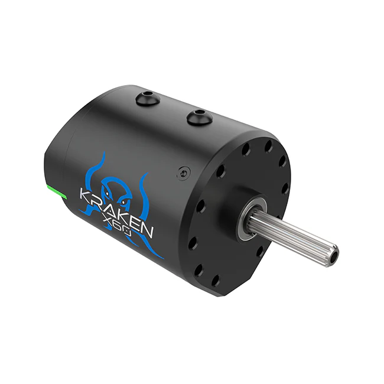

# Electronics Crash Course

## There are a lot of electrical components on an FRC robot, many of which we will need to interface with in software

### Electrical system diagram

This diagram shows many of the electrical components found on a typical FRC robot.
You don't need to memorize this layout, but its handy to have this as a reference.

### Battery

All of the power our robot uses comes from a single 12-volt car battery.
These can be found on our battery cart in the corner of the lab.
Not all batteries are created equal: Some brands and specific batteries can hold more juice for longer than others.
One way we can see the performance of a battery is the resting voltage (or voltage when no motors or similarly power hungry devices are running) of the battery after it has charged.
This can be checked with the battery beak or on the driver station.
A good battery will have a resting voltage of over 13 volts, and any battery we use will be above 12.
As the battery is used the voltage will go down.
We tend to swap our batteries after they get to around 12.5 volts, although if we are testing something sensitive to voltage (like auto) we might swap them sooner.
After a match a good battery is usually still above 12 volts.
To track batteries so we know which batteries are "good" and which are "bad" we give them names like "Garbanzo" or "W.I.S. (Women In STEM)".

When the robot is on, the voltage will drop as power is used by processors and lights.
When the robot is enabled, the voltage will drop further as power is actively used by mechanisms.
This is called voltage sag.
This means that we can't pull full power from every motor on the robot at once and have to be careful to design and program around our power budget.
When the voltage of the robot drops too low we can brownout.
This is usually first visible when the LEDs on the robot go out.
When the voltage is low enough, motors will begin to be turned off automatically, which is visible as a stuttering or jerking.
If the voltage is even lower, the robot can restart.
Needless to say, we want to avoid any brownout conditions in a match or when testing, but we often end up seeing them when pushing the robot in testing.

$V = IR$ is the equation which governs voltage sag, where $V$ is amount the voltage will sag from resting, $I$ is the current draw of the robot, and $R$ is the internal resistance of the battery.

### Main Breaker

The main breaker is the power switch of the robot.
The red button will turn the robot off, and a small black lever on the side of the breaker will turn it on.
The main breaker is directly connected to the battery and limits the current draw of the robot, or the amount of power it can use at once.
This limit is theoretically 120a, but in practice we can draw much more than that for small but significant periods of time (several seconds).
Whenever you need to be hands on with the robot, make sure the breaker is off.
If you can't connect to the robot, make sure it's on.
If the breaker is on, make sure to wear safety glasses.

The breaker should be mounted in a visible and accessible location on all robots, although it tends to blend in with its black casing.
We tend to have a 3d-printed guard over the off switch to prevent accidental presses by other robots mid-match.

### Power Distribution Hub (PDH)

The PDH takes the power from the battery and distributes it to the motors, sensors, and other components on the robot (Almost like its a hub for distributing power!).
We don't have to do anything with the PDH in code, but if a motor or sensor does not have power it could have a bad connection with the PDH.
The PDH will also have a smaller breaker for each motor on it, which limits the power draw from each individual motor to 40 amps.
In practice, we can draw more for a short period of time.
If you are interested in more details about how and why that works, look at the electrical coursework for the team.

There is a similar product manufactured by CTRE called the Power Distribution Panel, or PDP.
This is essentially an older version of the PDH with fewer motor slots, and is largely legacy hardware.
You might see it in older documentation and robots, however.

The PDH is also often at one end of our CAN network. What's CAN? Glad you asked . . .

### The CAN Network

CAN is a type of communication along wires that allow our sensors and motors to communicate along our robot.
In FRC, CAN is transmitted over yellow and green pairs of cables.
Each device on the CAN network has a unique ID that it uses to talk to other devices on the network.
All of our motors and many of our sensors will communicate over CAN.
CAN is also one of the easiest places for electrical problems to become apparent in software because of the thin wires and large reach of the system.
When you start up the robot you may see red error messages in the drive station console reporting CAN errors.
If you see that, something might be broken on the CAN network.

We have to set the IDs of the devices on the CAN network to make sure they are all uniquely and correctly identified.
It would be very awkward to try to drive the robot and accidentally run the elevator instead of the drivetrain!
To set the IDs of devices on the CAN network we use the [Tuner X](https://pro.docs.ctr-electronics.com/en/stable/docs/tuner/index.html) app built by CTRE.
This app also has features to test and configure devices on the CAN network.

### CANivore

The CANivore is a device that connects to the [Rio](#roborio-2) (in the next section) over usb.
It allows us to have a second CAN network with increased bandwidth.
This is useful because CAN has a limited amount of information that can travel over it each second, and we can easily reach that limit with the number of motors and sensors we have.
The CANivore gets around some hardware limitations of the Rio to have extra bandwidth on its network compared to the default network.
This also enables some extra latency compensation features on CTRE devices.
In 2024 we exclusively used the CANivore network for motors and sensors.

### RoboRIO 2

The RoboRIO (rio) is the brain of the robot.
It is built around a computer running Linux with a large number of Input/Output (IO) ports.
These ports include:

- Digital IO (DIO) can accept inputs and outputs that are either a 1 or 0, on or off.
  When used as an input the signal can rapidly be turned on and off to send numerical data.
  This is done using Pulse Width Modulation (PWM), essentially measuring how long a signal is on compared to how long it is off in a given time window to get a numerical value.
  For more information on PWM optionally read [this article](https://learn.sparkfun.com/tutorials/pulse-width-modulation/all)
- PWM pins provide additional pins to _output_ PWM signals.
  Unlike the DIO ports the PWM ports cannot take inputs.
  Many motor controllers support using a PWM signal for control instead of CAN, although it has significantly limited features.
- Analog inputs provide adititional sensor ports, although most sensors use DIO or CAN.
- The large set of pins in the middle of the Rio is the MXP port.
  MXP (and the SPI port in the top-right corner) is used for communication over serial interfaces such as I²C protocal.
  Unfortunately, there is an issue with I²C that can cause the code to lock up when it is used, so we avoid using the serial ports.
  We can get around this issue by using a coprocessor (computer other than the rio, like a raspberry pi) to convert the signal to a different protocol.
  Generally we avoid using I²C devices.
- A CAN network originates at the RIO.
- Several USB ports are available on the Rio.
  Common uses include external USB sticks to store logs or the [CANivore](#canivore) (see later in this page).
  The usb ports can also be used to connect the rio to a computer to deploy code and run the robot, although we usually prefer to use ethernet if we need to run tethered.
- An ethernet port which connects to the radio (in the next section) to communicate to the driver station.

The Rio also has an SD card as its memory.
When we set up a Rio for the season we need to image it using a tool that comes with the driver station.
The WPILib docs have [instructions](https://docs.wpilib.org/en/stable/docs/zero-to-robot/step-3/roborio2-imaging.html) on how to image the SD card.

### Note on 2026-7+ Control System
As per [this](https://community.firstinspires.org/introducing-the-future-mobile-robot-controller) blog post, FRC will use a different robot control system called SystemCore beginning with the 2027 season.
This moves away from the RoboRIO and NI and instead will use a controller based on the Raspberry Pi CM5.
As we have not been selected for beta testing at this time, we don't have a lot of information about this right now, but it's good to keep this on your radar.
**(Leads should remember to update this part of the article in the fall of 2026!)**

### Vivid Hosting Radio

The VH-109 radio is essentially a Wi-Fi router that lives on the robot and connects it to the driver station.
At tournaments we have to take the radio to get reprogrammed for that competition.
This makes it able to connect to the access point (another radio on the field) so that our robot gets enabled and disabled at the right times during matches, however it prevents us from connecting to the robot with a laptop wirelessly $`^1`$.
The radio has four ethernet ports and a pair of terminals for power wires.
One ethernet port connects to the rio and is labeled RIO.
One is usually reserved for tethering to a laptop and is labeled DS.
We can connect certain advanced sensors, like vision systems, to ethernet.
Sometimes we add a network switch to the ethernet network, which is a device that allows us to have more ethernet ports than the radio provides.
Network switches and other ethernet devices are plugged into the AUX1 and AUX2 ports on the radio.

After each competition we have to reimage the radio to allow it to connect to a laptop wirelessly again.
Refer to the [vivid hosting radio documentation](https://frc-radio.vivid-hosting.net/) for more information.

We can also connect to the robot's VH-109 by connecting to a second network (which comes from a second radio that's connected to the robot).
This radio could be the VH-113 access point, which is a larger radio that is for the field instead of going on a robot, or a VH-109 configured to act like a VH-113.
This is the setup we'll usually be using at the Loom.

The radio can either be powered using Power-Over-Ethernet (PoE) or the power terminals.
Be careful with checking for good, consistent radio power if you are having connection issues.

An older radio known as the OM5P was in use until champs 2024, and you may encounter some on old/offseason robots.
It was much worse to deal with (more fragile and finicky) and we are lucky to be done with it.
It is pictured below.

### Motor Controllers

Motors are the primary form of movement on the robot, but on their own they are just expensive paperweights.
Motor controllers take signals from our code, often over CAN, and turn them into the voltage sent to the motor.
These controllers plug into slots on the PDH, the CAN network (or much more rarely PWM ports), and the power lines of the motor.

Many motor controllers have more features than just commanding a voltage to a motor.
For instance they might be able to run PID loops much faster than our code is able to, which drives a motor to a specific position or velocity.
Knowing what motor controller you are using and what features it has is very important when writing robot code.
Pictured above is the Spark Max built by REV Robotics, a common modern motor controller often used with the NEO and NEO 550 motors.
REV also produces a motor called the NEO Vortex which uses the Spark Flex, pictured below.

However, we avoid using REV motors due to poor software and historical mechanical issues.
Instead we use . . .

### The Talon FX + Kraken X60/44

The Kraken X60 ("Kraken") motor is the primary motor we use on the robot.
Unlike many other motors, Krakens come with a built in motor controller called the Talon FX.
The Kraken also has a built in encoder, or sensor that tracks the rotation and speed of the motor.
Documentation for the software to control Krakens can be found [here](https://pro.docs.ctr-electronics.com/en/stable/).
There is also the Kraken X44, which is mostly the same as the X60 but a bit smaller and lighter.
It looks the same in code to us, since it also has a TalonFX controller.

We also use the Falcon 500 ("Falcon") motor in some places on the robot.
Slightly less powerful, slightly older, and likely out of stock for the forseeable future, Falcons are slowly being phased out of our motor stock.
Because Falcons also have an integrated TalonFX, they behave exactly the same in code as Krakens.
A Falcon is pictured below.

### Solenoids and Pneumatics

Pneumatics are useful for simple, linear, and repeatable motions where motors might not be ideal.
In the past we have used them primarily for extending intakes.
If pneumatic pistons are like motors, solenoids are like motor controllers.
A solenoid takes a control signal and uses it to switch incoming air into one of two output tubes to cause it to either extend or retract.
We usually use double solenoids, which have both powered extension and retraction.
Single solenoids only supply air for extension, and rely on the piston having a spring or something similar to retract them.
Our mechanical team has moved somewhat away from pneumatics over weight and complexity concerns, but they may still appear on future robots.

### Servos

Servos are similar to motors in that they can produce rotational motion, but are designed for very precise rotation.
Servos are somewhat more common in FTC than FRC, but are good for "single use" mechanisms or something that needs to go to a specific position.
In 2025, we used 2 servos to open the funnel hatch panel in order to climb.

### Robot Status Light

The Robot Status Light (RSL) is an orange light we are required to have on our robot by competition rules.
When the robot is powered on it will glow solid orange.
When the robot is enabled ie being controlled by joysticks or autonomous code it will flash orange.
This is handled automatically by WPILib.
**When the robot is enabled wear safety glasses and do not go near the robot**.

We have additional LEDs on the robot that indicate the state of the robot, but they are not standardized year to year and should not be relied upon for safety information.

## Sensors

### Encoders

Encoders are devices that measure rotation.
We use them to measure the angles of our swerve modules, the speed of our wheels, the position of our elevator, and much more.
Modern motors have encoders built in.
However, absolute encoders are only useful when they cannot rotate more than once, because they only return their position in a 0-360 degree range.
Motors are almost always geared down such that the motor rotates multiple times per rotation of the mechanism it is attached to, making the absolute data not so absolute.
While this gearing is required to get enough torque from the motor, this is something to keep in mind when prototyping or looking at designs for mechanisms.
If a mechanism has an absolute encoder, it should be rotating 1 or less rotations over the mechanism's range.
If it is infeasable to have an encoder that goes 1 or less rotations for a mechanism, you might want to take a look at the next section, [Limit Switches](#limit-switches)

Some examples of absolute encoders are the CTRE CANcoder (upper picture).
The CANcoder sends absolute position and velocity data over the CAN network and uses a magnet embedded in the mechanism to keep track of position.
We use these to track the heading of our swerve modules.
However, designing and manufacturing mechanisms to hold that magnet is inconvenient so we don't usually use CANcoders for other mechanisms.

The Rev Through Bore encoder (lower picture) solves this mounting problem by connecting directly to hex shaft (the most common type of shaft in FRC).
However, the Through Bore does not communicate over CAN and requires wiring to the DIO ports.
We used one of these on the hood of our 2022 robot.

Some teams have seen success getting around the absolute encoder only having one rotation of usefullness by using [Chinese remainder theorem](https://en.wikipedia.org/wiki/Chinese_remainder_theorem) alongside multiple encoders.

### Limit Switches

A limit switch is a simple sensor that tells us whether a switch is pressed or not.
They are one of the electrically simplest sensors we can use, and are quite useful as a way to reset the encoder on a mechanism ("Zero" the mechanism).
They can also be used to set up safety limits for mechanisms so they don't damage themselves or others.
They are quite fragile, however, so absolute encoders are better to be used where possible.
We used a limit switch on our 2023 robot that was pressed when the elevator was fully retracted.
When it was pressed, we knew that the elevator must be fully retracted so we could reset the encoder to 0 inches of extension.

However, due to the fragility and additional wiring necessary for limit switches we have moved away from them.
Instead, we use "current zeroing".
This involves slowly powering a mechanism into a hardstop with a known position (like an elevator being all the way down).
When the current draw of the motor spikes, we know that the motor is "stalling", or using power but not moving.
This tells us that we are at the hardstop in the same way that a limit switch would.

### IMU

An Inertial Measurement Unit (IMU or sometimes Gyro) is a sensor that measures its acceleration and rotation.
We primarily use them to measure the rotation of the robot (heading) so that the robot knows which way it is pointing on the field.
This lets us run field-relative swerve drive.
Pictured above is the Pigeon 2.0 IMU by CTRE, an IMU that connects over the CAN network.

### Beambreaks/Light Sensors

A beambreak has two parts: an emitter, which sends out a beam of infrared light, and a receiver, which is directly across from the emitter and receives that light.
These are useful for when we need to detect if something like a game piece is present or not.
If we mount the two parts on opposite sides of a mechanism, the game piece will block the light from reaching the other side and thus tell us that it's there.

We might use an IR reflective sensor if we don't want to or can't add the receiver part, but this works in the same way by detecting when something's blocked the beam of light coming from the emitter.

### Cameras and Vision

Cameras and vision systems are an important part of advanced FRC software.
Vision in FRC can be used to detect visual markers called AprilTags on the field, game pieces, and even other robots.
The pictured camera is a Limelight camera, a purchaseable vision solution that connects to the robot over ethernet and we used from 2021-2023.

However, we've moved towards custom hardware, such as [Arducam cameras](https://www.arducam.com/product/arducam-100fps-global-shutter-usb-camera-board-1mp-720p-ov9281-uvc-webcam-module-with-low-distortion-m12-lens-without-microphones-for-computer-laptop-android-device-and-raspberry-pi/) and [Orange Pi processors](http://www.orangepi.org/).
See the [Vision](..\3_Specifics\3.5_Vision.md) article for more details.
The cameras plug into the USB ports on the Orange Pi.
The Orange Pi connects to the radio over Ethernet,
It's powered off the PDH with a buck/step down converter (which decreases voltage and increases current, since the Orange Pi only takes 5V and not 12).
If you're having issues, check the PhotonVision docs pages on [networking](https://docs.photonvision.org/en/latest/docs/quick-start/networking.html) and [wiring](https://docs.photonvision.org/en/latest/docs/quick-start/wiring.html).