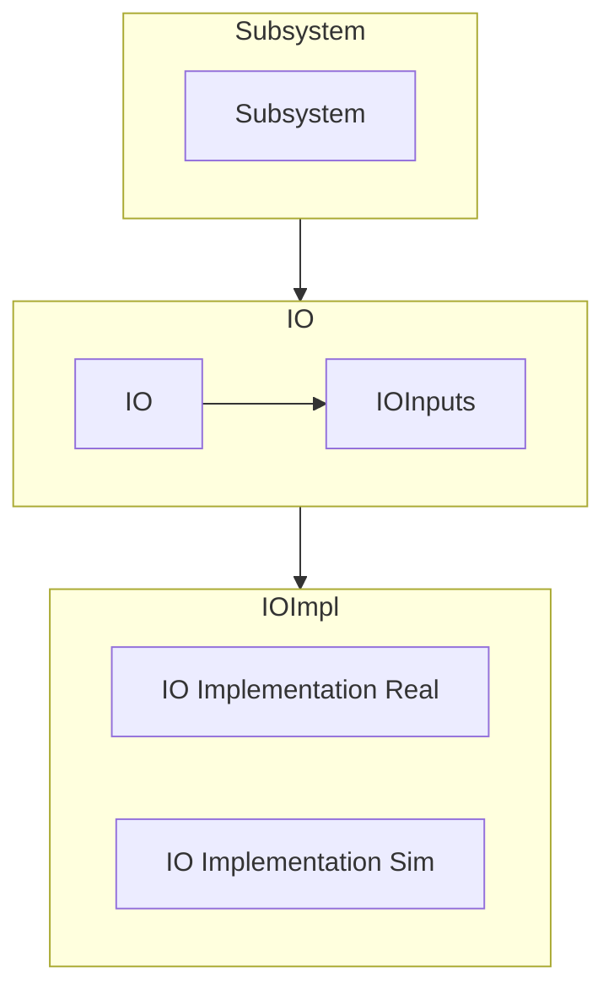
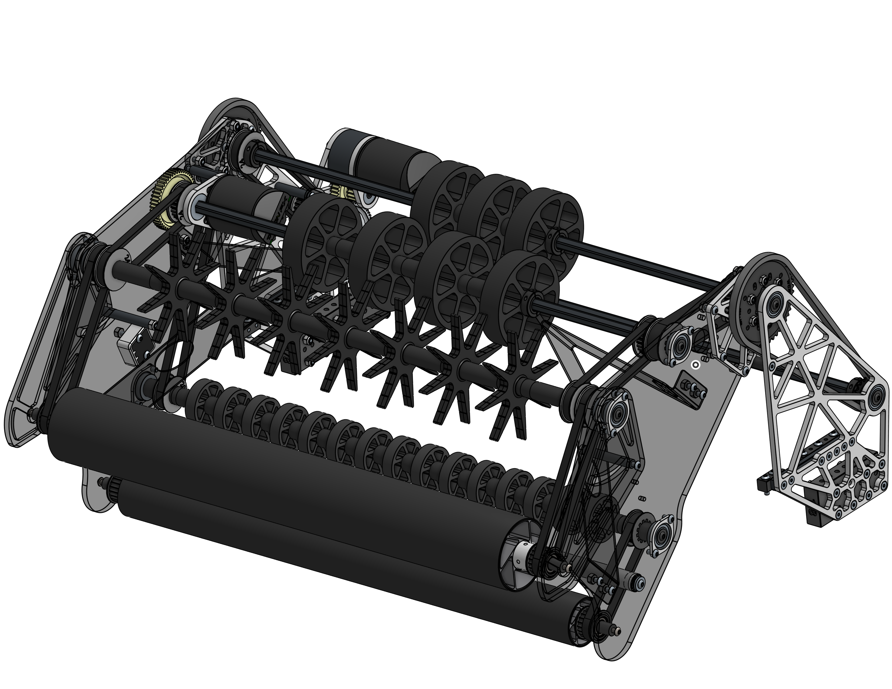
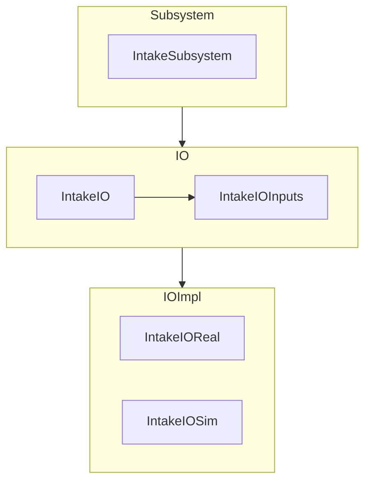
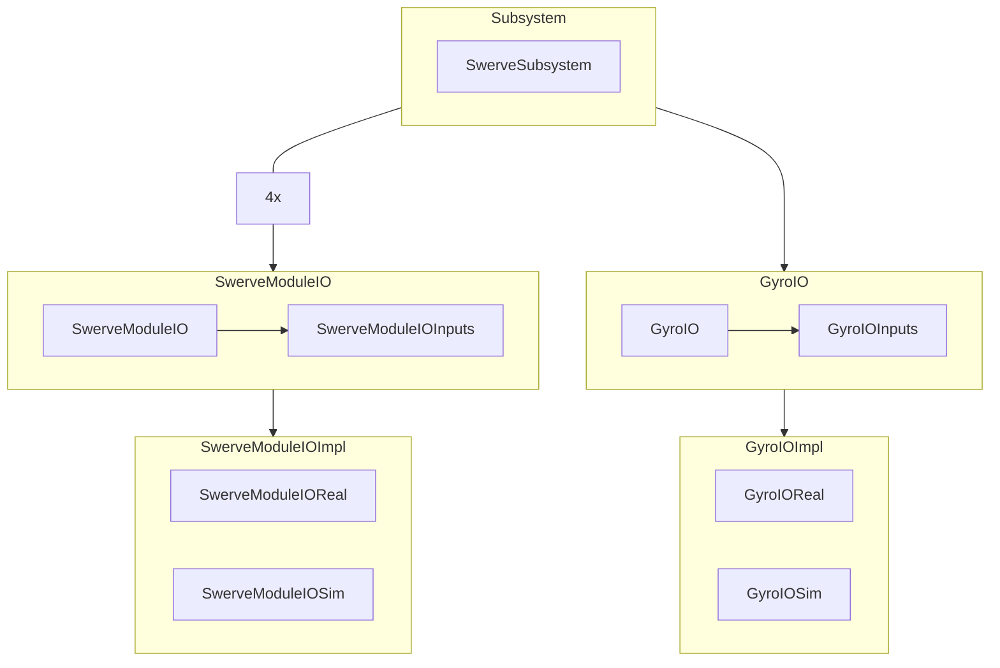

# AdvantageKit Code Structure Reference

This document contains a quick reference for how we structure our code.
It should be used when planning out the structure of a subsystem.

## Basic Layout



This diagram shows the basic structure of an AKit Subsystem.
It includes 3 layers:

### Subsystem

- The "subsystem" layer is a class which `extends SubsystemBase`.
- This class should contain methods that return Commands for this subsystem.
- This class should contain all higher-level control flow within this mechanism.
  - For instance, it could contain a `SwerveDriveOdometry` object to track a drivetrain's position.
  - It might contain information about the current target of a mechanism, or whether or not the mechanism has homed its position yet.
  - *Generally, this information should all be **"processed" information** that we derive from our IOInputs.
- The `Subsystem` file will contain one `IO` instance and one `IOInputs` instance, conventionally called `io` and `inputs` respectively.

### IO

- The "IO" layer defines the interface with our hardware, as well as all the values we will log.
- This includes an `interface` called `SubsystemIO` which defines a set of methods to interact with the hardware, such as `setVoltage` or `getPosition`.
However, it doesn't define *how* to do them, because that's specific to each implementation.
The interface just provides a template.
- This class will also include an `updateInputs` method, which takes in an `IOInputs` object and updates it with the latest sensor data from the mechanism.
- The `IOInputs` object is a class that contains various measurements and sensor data about the mechanism, like current draw, encoder position, and voltage output.
- It is marked with `@AutoLog` which means all the inputs and outputs for the subsystem will be automatically recorded in the log, so we can play it back later.

### IO Implementations

- These are classes which `implement` the aforementioned `IO` class.
- This means they will specify how to do all of the methods defined in the `IO` class.
- Generally we will have 2 types of `IOImplementation`, `IOSim` and `IOReal`.
  - `IOReal` defines its methods to command real hardware to have real outputs.
  - `IOSim` often looks similar to `IOReal`, but will have some behaviour added to fake the behaviour of real world physics.
    This can include a physics sim which approximates physical behaviour, setting outputs which we can't sim to a default value (like temperature), or other ways of "faking" real world behaviour.
- `IOImplementation`s will contain the actual objects such as `TalonFX`s (for `IOReal`) or `DCMotorSim`s (for `IOSim`).

## Intake Example



This example will cover how the code for an intake such as the one above might be set up.



Let's start by defining the methods in the `IntakeIO` interface.
There are two motors on this slapdown intake--one that controls the pivot, and one that controls the rollers.
The intake needs to set its position (extended or retracted), so we will need a `setAngle(Rotation2d angle)` method.
We will also need a way to set the rollers' output, so let's add a `setRollerVoltage(double volts)` method.
For convenience, let's add a method `stop()` that calls `setRollerVoltage()` with a voltage of 0.

We also need to add our `IntakeIOInputs` to the `IntakeIO` file.
This should contain all of the sensor information we need to know about our intake so that we can debug its behaviour with logs.
Then we can add our logged fields for the motor.

Here is a list of common logged fields for motors:

- Velocity (Often but not always in rotations per second)
  - This is the main field we care about to see if the motor is moving.
- Current draw (Amps)
  - This lets us see if the motor is stalling (trying to move but stuck) as well as how much energy the motor is using.
- Temperature (Celsius)
  - If a motor gets too hot it will turn itself off to protect its electronics.
    This lets us see if we are having issues related to that.
    In addition, motors are less efficient as they heat up.
- Voltage (Voltage)
  - This lets us see how much we are commanding our motors to move.
- Position (Rotations or inches, often after a gear reduction)
  - This lets us track the position of the motor and its corresponding mechanism.

We can add all of these values into our `IntakeIOInputs` class.

Finally, add a `updateInputs(IntakeIOInputs inputs)` method that our `IOImplementation`s can call to record these values.
Our `IntakeIO` file should look something like this now:

```Java
// Imports go here

public interface IntakeIO {
    @AutoLog
    public class IntakeIOInputs {

        // Pivot motor values
        public double pivotVelocityRotationsPerSec;
        public double pivotCurrentDrawAmps;
        public double pivotTemperatureCelsius;
        public double pivotVoltage;
        public Rotation2d pivotMotorPosition;

        // Roller motor values
        public double rollerVelocityRotationsPerSec;
        public double rollerCurrentDrawAmps;
        public double rollerTemperatureCelsius;
        public double rollerVoltage;
    }

    // Methods that IOImplementations will implement
    public void setAngle(Rotation2d angle);

    public void setRollerVoltage(double volts);

    // Note the use of "default"
    // This means that we don't have to re-implement this method in each IOImplementation, because it will default to
    // whatever the specific implementation of setVoltage() is
    public default void stop() {
        setRollerVoltage(0);
    }

    public void updateInputs(IntakeIOInputs inputs);
}
```

Next, let's write `IntakeIOReal`.
This will contain all of the hardware we want to interact with on the real robot.

First, we will need to define the hardware we want to use.
In this case, they will be two `TalonFX`s.

```Java
private final TalonFX pivot = new TalonFX(IntakeSubsystem.PIVOT_MOTOR_ID);
private final TalonFX roller = new TalonFX(IntakeSubsystem.ROLLER_MOTOR_ID);
```

Next we will need to implement each of the methods from `IntakeIO`.
Each should `@Override` the template method.
For the sake of brevity, I won't cover that in detail here. *MAKE SUBSYSTEM WALKTHROUGH AND LINK HERE*

In the end you should have something like:

```Java
public class IntakeIOReal implements IntakeIO {
    private final TalonFX pivot = new TalonFX(IntakeSubsystem.PIVOT_MOTOR_ID);
    private final TalonFX roller = new TalonFX(IntakeSubsystem.ROLLER_MOTOR_ID);

    @Override
    public void updateInputs(IntakeIOInputs inputs) {
        // Note that the exact calls here are just examples, and might not work if copy-pasted

        inputs.pivotVelocityRotationsPerSec = pivot.getVelocity();
        inputs.pivotCurrentDrawAmps = pivot.getStatorCurrent();
        inputs.pivotTemperatureCelsius = pivot.getDeviceTemp();
        inputs.pivotVoltage = pivot.getMotorVoltage();
        inputs.pivotMotorPosition = pivot.getMotorPosition();

        // Roller motor values
        inputs.rollerVelocityRotationsPerSec = roller.getVelocity();
        inputs.rollerCurrentDrawAmps = roller.getStatorCurrent();
        inputs.rollerTemperatureCelsius = roller.getDeviceTemp();
        inputs.rollerVoltage = roller.getMotorVoltage();
    }

  @Override
  public void setRollerVoltage(double volts) {
    roller.setVoltage(volts);
  }

  // Note how we don't need to define stop() because it has a default implementation that does what we want

  @Override
  public void setAngle(Rotation2d angle) {
    pivot.setAngle(angle);
  }
}
```

We can make a similar class for `IntakeIOSim`, although instead of getting motor outputs directly we would have to use `motor.getSimState()`.
For more information about that, check the [CTRE docs](https://pro.docs.ctr-electronics.com/en/stable/docs/api-reference/simulation/simulation-intro.html).

Finally, let's write the `IntakeSubsystem` class.
This class will include an instance of `IntakeIO` and an instance of `IntakeIOInputs`.
It will also contain Command factories to allow the rest of our code to interface with it.

Add the io and io inputs to the class:

```Java
// Snip imports

public class IntakeSubsystem extends SubsystemBase {
    private final IntakeIO io;
    private final IntakeIOInputsAutoLogged inputs = new IntakeIOInputsAutoLogged();

    public IntakeSubsystem(IntakeIO io) {
        // Pass in either the sim io or real io
        this.io = io;
    }
}
```

Then we can add a few Command factories to control the subsystem:

```Java
public Command intake(double volts) {
    return Commands.run(() -> {
        io.setAngle(INTAKE_ANGLE);
        io.setRollerVoltage(volts);
    });
}

public Command stop() {
    return Commands.runOnce(() -> {
        io.setAngle(RETRACTED_ANGLE);
        io.stop();
    });
}
```

Finally, let's add our `periodic()` method to update and log our inputs.

```Java
@Override
public void periodic() {
    io.updateInputs();
    // Make sure to import the "littletonRobotics" Logger, not one of the other ones.
    Logger.processInputs("Intake", inputs);
}
```

Overall, `IntakeSubsystem` should roughly look like:

```Java
// Snip imports

public class IntakeSubsystem extends SubsystemBase {
    IntakeIO io;
    IntakeIOInputsAutoLogged inputs;

    public IntakeSubsystem(IntakeIO io) {
        // Pass in either the sim io or real io
        this.io = io;
        inputs = new IntakeIOInputsAutoLogged();
    }

    public Command intake(double volts) {
        return Commands.run(() -> {
            io.setAngle(INTAKE_ANGLE);
            io.setRollerVoltage(volts);
        });
    }

    public Command stop() {
        return Commands.runOnce(() -> {
            io.setAngle(RETRACTED_ANGLE);
            io.stop();
        });
    }

    @Override
    public void periodic() {
        io.updateInputs();
        // Make sure to import the "littletonRobotics" Logger, not one of the other ones.
        Logger.processInputs("Intake", inputs);
    }
}
```

### More complex subsystems

The intake is a very simple to program subsystem, but more complex ones exist.
A swerve drive might have the following set of classes:



This means that we will have one `SwerveSubsystem` class.
Within that class, we will have 4 instances of `SwerveModuleIO` and its corresponding `SwerveModuleIOInputs`, one for each module.
We will also have an instance of `GyroIO` and `GyroIOInputs`.
The `SwerveSubsystem` file handles coordinating and combining data from these `IO`s, and each `IO` handles turning the control signals from the `Subsystem` into motion in the hardware (or sim!).
