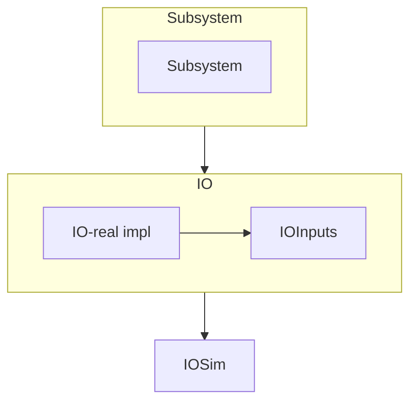
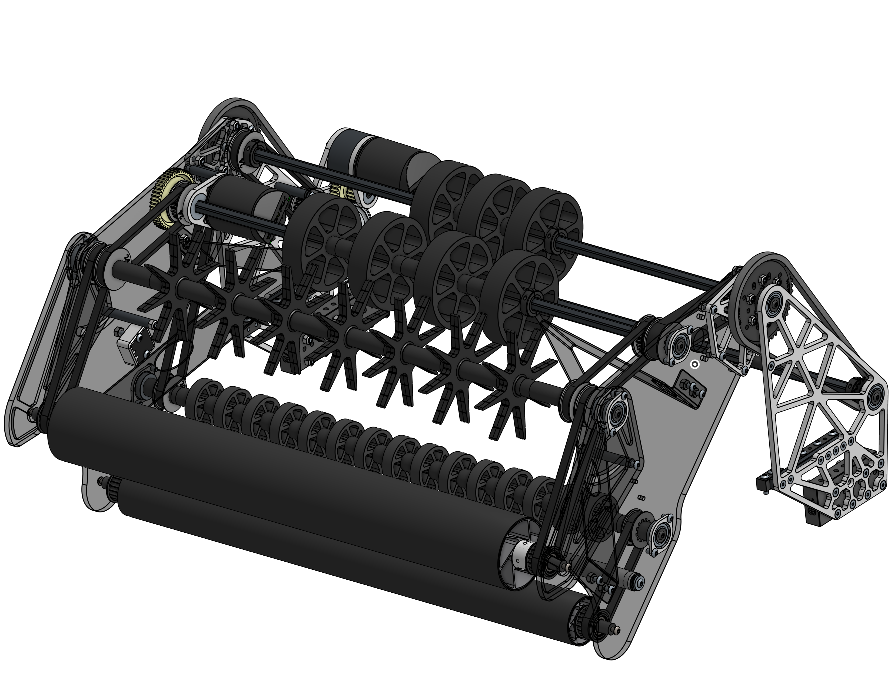
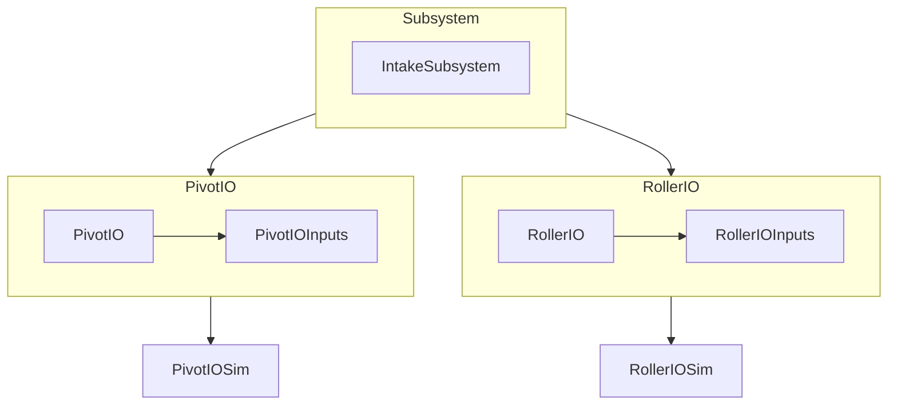
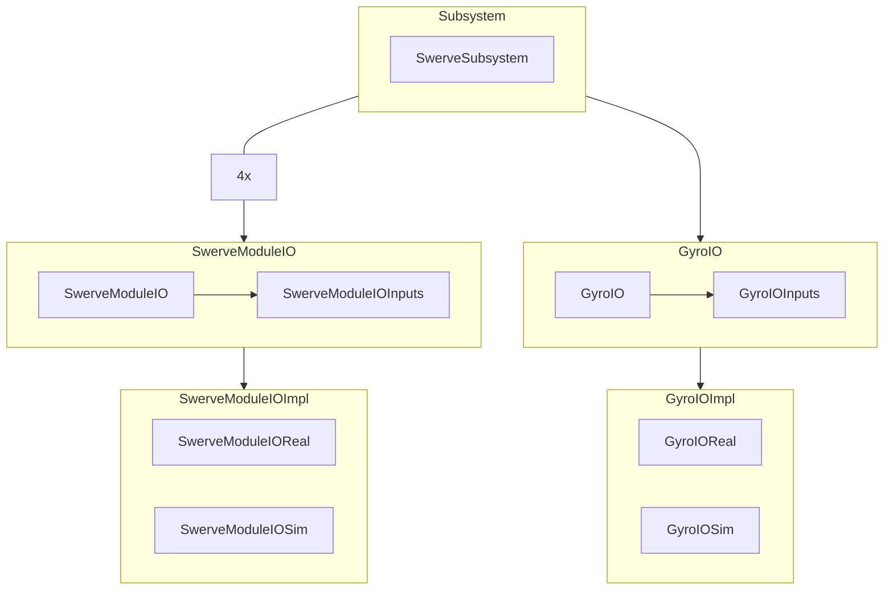

# AdvantageKit Code Structure Reference

This document contains a quick reference for how we structure our code.
It should be used when planning out the structure of a subsystem.

## Basic Layout


```mermaid
flowchart TD
    subgraph Subsystem
        A[Subsystem]
    end
    Subsystem-->IO
    subgraph IO
        direction LR
        B[IO-real impl]-->E[IOInputs]
    end
    IO-->C[IOSim]
```

This diagram shows the basic structure of an AKit Subsystem.
It includes 3 layers:

### Subsystem

- The "subsystem" layer is a class which `extends SubsystemBase`.
- This class should contain methods that return Commands for this subsystem.
- This class should contain all higher-level control flow within this mechanism.
  - For instance, it could contain a `SwerveDriveOdometry` object to track a drivetrain's position.
  - It might contain information about the current target of a mechanism, or whether or not the mechanism has homed its position yet.
  - *Generally, this information should all be **"processed" information** that we derive from our IOInputs.
- The `Subsystem` file will contain one `IO` instance and one `IOInputs` instance, conventionally called `io` and `inputs` respectively.
    - Keep in mind: A subsystem can contain multiple IOs that do different things (for example a roller and a pivot might have 2 IOs). You could also inlcude multiple degrees of freedom within one IO, its mostly up to personal preference.

### IO

- The "IO" layer defines the interface with our hardware, as well as all the values we will log.
- This includes an `interface` called `SomethingIO` which defines the real implementation (most of the time) of the hardware interface
- This class will also include an `updateInputs` method, which takes in an `IOInputs` object and updates it with the latest sensor data from the mechanism.
- The `IOInputs` object is a class that contains various measurements and sensor data about the mechanism, like current draw, encoder position, and voltage output.
- `IOInputs` is marked with `@AutoLog` which means all the inputs and outputs for the subsystem will be automatically recorded in the log, so we can play it back later.

### Sim Implementation

- IOSim extends IO (the real implementation), and adds additional functionality to simulate the movement of the mechanism.

## Intake Example



This example will cover how the code for an intake such as the one above might be set up. We will only walk through the pivot IO because the roller IO is very similar


```mermaid
flowchart TD
    subgraph Subsystem
        A[IntakeSubsystem]
    end
    Subsystem-->PivotIO
    subgraph PivotIO
        direction LR
        B[PivotIO]-->D[PivotIOInputs]
    end
    PivotIO-->H[PivotIOSim]
    Subsystem-->RollerIO
    subgraph RollerIO
        direction LR
        E[RollerIO]-->F[RollerIOInputs]
    end
    RollerIO-->G[RollerIOSim]
```

Let's start by defining the methods in the `PivotIO` class.
The intake needs to set its position (extended or retracted), so we will need a `setAngle(Rotation2d angle)` method.

We also need to add our `PivotIOInputs` to the `PivotIO` file.
This should contain all of the sensor information we need to know about our intake so that we can debug its behaviour with logs.
Then we can add our logged fields for the motor.

Here is a list of common logged fields for motors:

- Velocity (Often but not always in rotations per second)
  - This is the main field we care about to see if the motor is moving.
- Current draw (Amps)
  - This lets us see if the motor is stalling (trying to move but stuck) as well as how much energy the motor is using.
  - We usually log both stator and supply current. Stator current is related to the acceleration and torque of the motor, while supply current is the amount of current drawn from the battery.
- Temperature (Celsius)
  - If a motor gets too hot it will turn itself off to protect its electronics.
    This lets us see if we are having issues related to that.
    In addition, motors are less efficient as they heat up.
- Voltage (Voltage)
  - This lets us see how much we are commanding our motors to move.
- Position (Rotations or inches, often after a gear reduction)
  - This lets us track the position of the motor and its corresponding mechanism.

We can add all of these values into our `IntakeIOInputs` class.

Finally, add a `updateInputs(IntakeIOInputs inputs)` method that our `IOImplementation`s can call to record these values.
Our `IntakeIO` file should look something like this now:

```Java
// Imports go here

public class PivotIO {
    @AutoLog
    public class PivotIOInputs {

        // Pivot motor values
        public double velocityRotationsPerSec;
        public double statorCurrentAmps;
        public double supplyCurrentAmps;
        public double temperatureCelsius;
        public double voltage;
        public Rotation2d motorPosition;
    }

    // These still need to be implemented
    public void setAngle(Rotation2d angle) {}

    public void updateInputs(PivotIOInputs inputs) {}
}
```

Next, let's flesh out this class.
We need to add all of our hardware we want to interact with on the real robot.

First, we will need to define the hardware we want to use.
In this case, they will be one `TalonFX` (to interface with a Kraken motor).

```Java
private final TalonFX pivot;
```

Next we will need to implement each of the methods from `IntakeIO`.
For the sake of brevity, I won't cover that in detail here. *MAKE SUBSYSTEM WALKTHROUGH AND LINK HERE*

In the end you should have something like:
TODO: FIX THIS!
```Java
public class IntakeIOReal implements IntakeIO {
    private final TalonFX pivot = new TalonFX(IntakeSubsystem.PIVOT_MOTOR_ID);

    public void updateInputs(IntakeIOInputs inputs) {
        // Note that the exact calls here are just examples, and don't work if copy pasted. To see

        inputs.velocityRotationsPerSec = pivot.getVelocity();
        inputs.statorCurrentAmps = pivot.getStatorCurrent();
        inputs.supplyCurrentAmps = pivot.getSupplyCurrent();
        inputs.temperatureCelsius = pivot.getDeviceTemp();
        inputs.voltage = pivot.getMotorVoltage();
        inputs.motorPosition = pivot.getMotorPosition();
    }

  public void setAngle(Rotation2d angle) {
  }
}
```

We can make a similar class for `IntakeIOSim`, although instead of getting motor outputs directly we would have to use `motor.getSimState()`.
For more information about that, check the [CTRE docs](https://pro.docs.ctr-electronics.com/en/stable/docs/api-reference/simulation/simulation-intro.html), and see [2.9 Simulation](2.9_Simulation.md).

Finally, let's write the `IntakeSubsystem` class.
This class will include instances of our IOs and instances of their respective inputs.
It will also contain Command factories to allow the rest of our code to interface with it.
Lets assume `RollerIO` has been implemented elsewhere.

Add the io and io inputs to the class:

```Java
// Snip imports

public class IntakeSubsystem extends SubsystemBase {
    private final PivotIO pivotIo;
    private final PivotIOInputsAutoLogged pivotInputs = new PivotIOInputsAutoLogged();

    private final RollerIO rollerIo;
    private final RollerIOInputsAutoLogged rollerInputs = new RollerIOInputsAutoLogged();

    public IntakeSubsystem(PivotIO pivotIo, RollerIO rollerIO) {
        // Pass in either the sim io or real io
        this.pivotIo = pivotIo;
        this.rollerIo = rollerIo;
    }
}
```

Then we can add a few Command factories to control the subsystem:

```Java
public Command intake(double volts) {
    return Commands.run(() -> {
        pivotIo.setAngle(INTAKE_ANGLE);
        rollerIo.setRollerVoltage(volts);
    });
}

public Command stop() {
    return Commands.runOnce(() -> {
        pivotIo.setAngle(RETRACTED_ANGLE);
        rollerIo.stop();
    });
}
```

Finally, let's add our `periodic()` method to update and log our inputs.

```Java
@Override
public void periodic() {
    pivotIo.updateInputs(pivotInputs);
    // Make sure to import the "littletonRobotics" Logger, not one of the other ones.
    Logger.processInputs("Intake/Pivot", pivotInputs);

    rollerIo.updateInputs(rollerInputs);
    Logger.processInputs("Intake/Roller", rollerInputs);
}
```

Overall, `IntakeSubsystem` should roughly look like:

```Java
// Snip imports

public class IntakeSubsystem extends SubsystemBase {
    private final PivotIO pivotIo;
    private final PivotIOInputsAutoLogged pivotInputs = new PivotIOInputsAutoLogged();

    private final RollerIO rollerIo;
    private final RollerIOInputsAutoLogged rollerInputs = new RollerIOInputsAutoLogged();

    public IntakeSubsystem(PivotIO pivotIo, RollerIO rollerIO) {
        // Pass in either the sim io or real io
        this.pivotIo = pivotIo;
        this.rollerIo = rollerIo;
    }

    public Command intake(double volts) {
        return Commands.run(() -> {
            pivotIo.setAngle(INTAKE_ANGLE);
            rollerIo.setRollerVoltage(volts);
        });
    }

    public Command stop() {
        return Commands.runOnce(() -> {
            pivotIo.setAngle(RETRACTED_ANGLE);
            rollerIo.stop();
        });
    }

    @Override
    public void periodic() {
        pivotIo.updateInputs(pivotInputs);
        // Make sure to import the "littletonRobotics" Logger, not one of the other ones.
        Logger.processInputs("Intake/Pivot", pivotInputs);

        rollerIo.updateInputs(rollerInputs);
        Logger.processInputs("Intake/Roller", rollerInputs);
    }
}
```

### More complex subsystems

The intake is a very simple to program subsystem, but more complex ones exist.
A swerve drive might have the following set of classes:


```mermaid
flowchart TD
    subgraph Subsystem
        A[SwerveSubsystem]
    end

    Subsystem--- 4x -->SwerveModuleIO
    subgraph SwerveModuleIO
        direction LR
        B[SwerveModuleIO]-->E[SwerveModuleIOInputs]
    end
    SwerveModuleIO-->SwerveModuleIOImpl
    subgraph SwerveModuleIOImpl
        C[SwerveModuleIOReal]
        D[SwerveModuleIOSim]
    end

    Subsystem--->GyroIO
    subgraph GyroIO
        direction LR
        X[GyroIO]-->GyroIOInputs
    end
    GyroIO-->GyroIOImpl
    subgraph GyroIOImpl
        GyroIOReal
        GyroIOSim
    end
```

This means that we will have one `SwerveSubsystem` class.
Within that class, we will have 4 instances of `SwerveModuleIO` and its corresponding `SwerveModuleIOInputs`, one for each module.
We will also have an instance of `GyroIO` and `GyroIOInputs`.
The `SwerveSubsystem` file handles coordinating and combining data from these `IO`s, and each `IO` handles turning the control signals from the `Subsystem` into motion in the hardware (or sim!).
