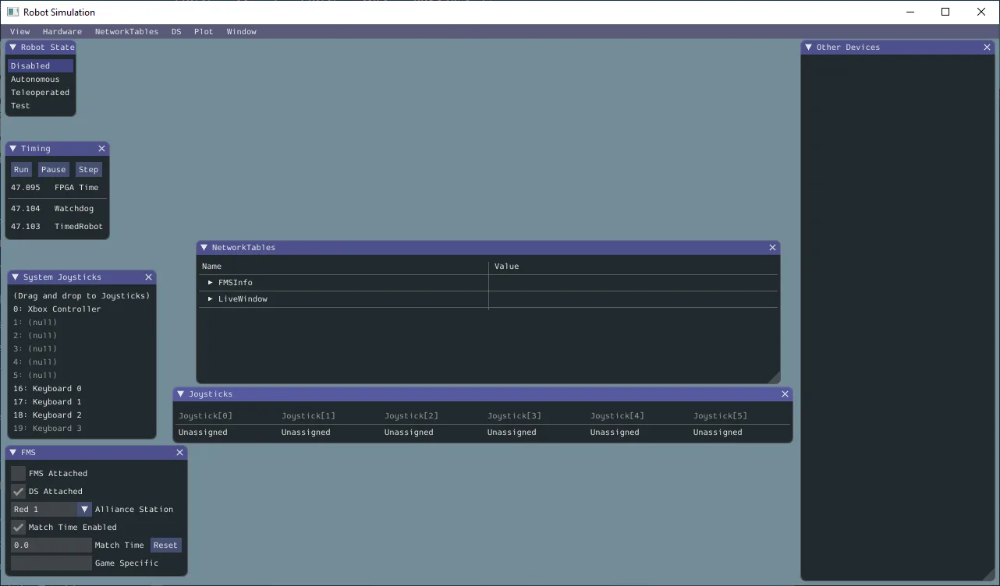

# Simulation

## Simulation is the process of running our robot code on a computer other than the robot to test it without being limited by physical hardware

Generally speaking, simulation depends on sending the inputs we would like to test to a model of a system (mechanism) and analyzing the simulated results.
There are several ways to do this, depending on what you’re simulating.
This could be something small, like simulated readings of an encoder, or something more complex, like a physics simulation of an arm.
Simulation is important for a couple of reasons—we can test something without risking breaking an actual physical part, as well as being able to concurrently develop code as those physical components are being built (which is often the case during the build season).

We have a number of tools at our disposal for simulation.
One is WPILib’s built in desktop simulation.
This handles the process of sending inputs (from joysticks, widgets in the sim dashboard, etc) and running robot code on a computer.
This is the backbone of our simulation.

The sim graphical user interface (GUI) looks like this and can be launched through the WPILib command palette.

From here, you can view some interesting bits of information about your simulated robot, such as whether it's enabled or not, how long it's been up, joysticks, etc. More details are [here](https://docs.wpilib.org/en/stable/docs/software/wpilib-tools/robot-simulation/simulation-gui.html#using-the-gui).

Then we have WPILib’s simulation physics classes.
These are built around a state space model of a class of mechanism and exist for many common mechanisms to predict how they will behave.

Quick digression on state space

A state is a characteristic of a system at a certain point in time.
A vector is just a way to represent these states.
(If you aren't familiar with vectors/matrices, that's okay!)
For example, a drivetrain system might have the states $\begin{bmatrix}x\\y\\\theta\end{bmatrix}$ to describe its position on the field - the x is the x position, y is the y position, and $\theta$ is the rotation of the robot, all in a column vector.
A state-space model is a set of matrix equations that describe how a system changes over time by basically multiplying these state vectors by (scalar) inputs.

---

Like other simulated systems, the mechanism’s state is updated periodically with simulated inputs.
For example, we can simulate the change in position of an elevator when a certain voltage is applied to its motor using this mathematical model.

Sometimes these models will be very accurate.
Sometimes they will make a lot of untrue assumptions about the mechanism.
Both are useful, since we will likely have to retune the mechanism one way or another once we have real hardware.
Deciding how much effort to put into a simulation model is a key part of the intuition you will build as you code more robots.
We tend to use one or two of these per robot for major mechanisms.
If you want to learn more about this sort of modeling, look at the [control theory for FRC book](https://file.tavsys.net/control/controls-engineering-in-frc.pdf).
Note that the topics covered by this book are largely far more advanced than high schoolers have the math background for, and it is not required reading.

Running a model is useful, but even more useful is being able to visualize the output of the model.
There are several dashboards you can use to do this, but we mainly use AdvantageScope.
[AdvantageScope](https://github.com/Mechanical-Advantage/AdvantageScope) is a tool developed by Team 6328 to visualize data from live robots, simulated robots, and robot logs.
It provides a variety of formats to visualize data from line graphs to 3d field models to tables and more.

It is closely integrated with AdvantageKit, a logging framework also from Team 6328, but does not require it.

The final major tool is being able to swap between simulated inputs and outputs (IO) and real IO easily and correctly.
We will cover what this looks like with AdvantageKit [here](AdvantageKit.md), but at a high level, this means that we have both a sim and real version of each mechanism in our code.
This is so we can easily test our code in sim and have minimal work to move it to real hardware.

### Resources

- Read through the [WPILib docs intro to simulation](https://docs.wpilib.org/en/stable/docs/software/wpilib-tools/robot-simulation/introduction.html).
- Optional additional reading on [state space modeling](https://docs.wpilib.org/en/stable/docs/software/advanced-controls/state-space/state-space-intro.html)

### Examples

- The [kitbot example code](../../Examples/KitbotDemoSim)

### Exercises

- Download and install [AdvantageScope](https://github.com/Mechanical-Advantage/AdvantageScope).
- Follow [this tutorial](KitbotExampleWalkthroughSim.md) to convert your kitbot code to AdvantageKit and simulation.

### Notes

- Structuring a codebase to be simulateable is not an easy task.
 It is important to be familiar with the tools we have and stick to a clean structure to make it easy to simulate our code.
- Code that has been tested in sim does not necessarily work on the robot.
Be sure to stay safe and prepare for unexpected behavior when testing, especially for the first time.