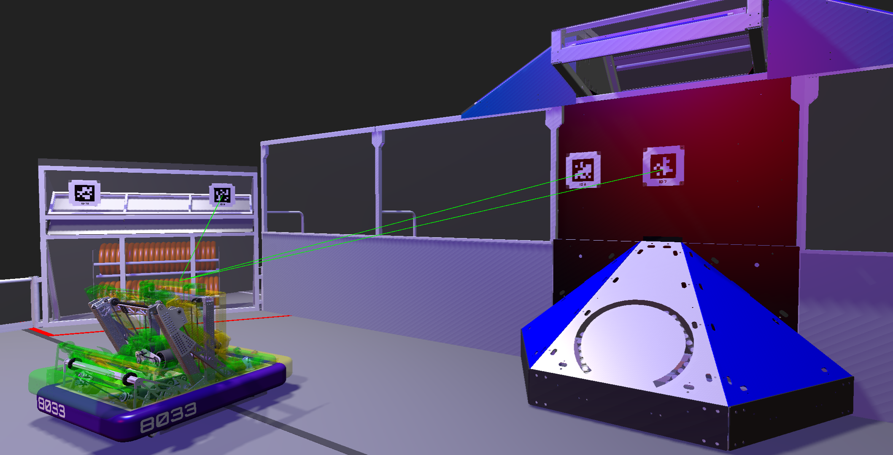
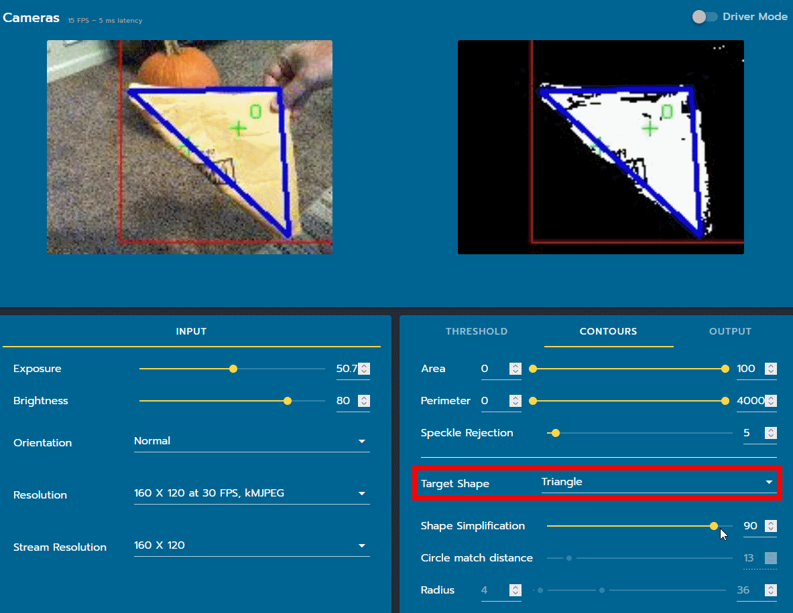
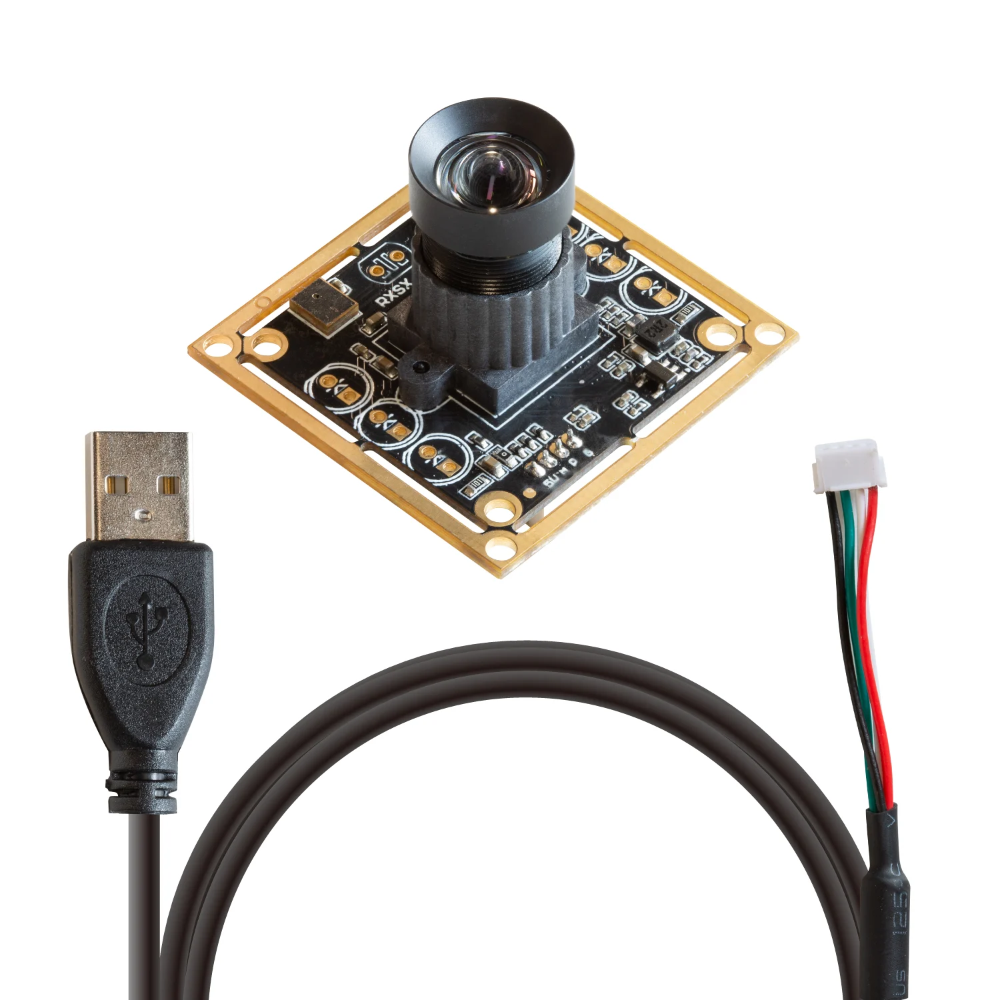

# Vision Processing

## Vision processing for FRC

When we navigate the world, we have our eyes and the parts of our brain that process that visual input to help us.
This is also the case for our robots—we have a camera connected to a processor that lets us use visual input in our code.

We primarily have two uses for vision: target detection and pose estimation.
The first usually involves some sort of visual fiducial marker (something that can act as a known point of reference to find your current location) near the target that we can align to and then score, which is relatively easy to set up.
The second involves a more complicated system of identifying where certain visual fiducial markers are relative to the robot and then using that to generate an estimated pose of the robot on the field.

### AprilTags

AprilTags are a system of visual tags developed by researchers at the University of Michigan to provide low overhead, high accuracy localization for many different applications.

They look similar to QR codes, but with less pixels.
This trades the amount of information in each tag for quick, easy, and robust detection.
There are several different "families" of tags depending on how many bits a tag can represent.
In 2023, the FRC game Charged Up used 16h5, while in 2024 (and presumably onwards) 36h11 was used instead.
In each frame in the camera stream, we are looking for these tags.
Through a series of image processing algorithms (removing colors, decimation, identifying regions of relative lightness/darkness), we're able to identify both *which* tag it is (a numerical ID corresponding to the unique pattern of the tag) and *where* the corners of the tag are in the frame.

In the context of FRC, because AprilTags are placed in various known locations around the field, we can use them in order for the robot to know where it is on the field.
The simplest application of this is single tag detection and 2D alignment.
For example, if we know that when a certain tag is in the middle of the camera's field of vision, our robot's shooter is lined up correctly with the target, we can write code that instructs the shooter to release a game piece once that tag has been centered, the drivetrain to adjust so that the tag is centered, etc.

### Pose Estimation
We can also use AprilTags in a more sophisticated way to perform pose estimation.
Once a tag and its corner locations have been detected, we can compare that to the known pose of that tag on the field and calculate an estimate of the distance, angle, etc. that the camera is from that tag.
We know where the camera is relative to the rest of the robot, so we can then estimate where the robot is on the field.
We'll also combine this estimate with the estimated pose returned by the wheels and gyro of the robot, which is known as odometry.
This is useful because with a reliable pose estimation system, we can automate more of the scoring process.
For example, in 2024 we were able to develop an accurate auto aim system based on the robot's estimated pose.

Pose estimation is more accurate when there are multiple tags in frame.
Each tag generates its own estimate, which can then be combined and used or discarded if one is inaccurate.

How would an estimate be incorrect?
One cause of this is pose ambiguity.

Humans are typically able to rely on things like depth perception and lighting to determine the difference between something like these two boxes, but it is more difficult for computers.
If we also have pose estimates from other tags that are less ambiguous, we can throw out those (likely) incorrect estimates if they're significantly off.
Having multiple cameras also helps with this, as another camera at a different angle could generate a more accurate pose with the same tag.
Comparing a vision pose against odometry can also rule out incorrect poses.

An important step to take before using 3D pose estimation is to correctly calibrate the camera.
All camera lenses have some level of distortion that we need to account for when processing images gathered from them, especially in applications where it's important to accurately calculate where things are in 3D space.

It's possible for us to undistort these images—we just need to find the camera-specific numbers that will allow us to perform that math, which we can do by calibrating the camera.
There are a couple ways to do this, but one way is to take a lot of photos with the camera being calibrated of a chessboard pattern (which we know has straight lines and certain measurements) at different angles and positions and send those photos to programs that then handle the math for us and return those numbers.

### Object Detection

Sometimes we want to be able to detect other things on the field that aren't AprilTags.
This could include game pieces, other robots, and more.
One way of accomplishing this is through tuning HSV thresholds to only pick up on a certain color, such as the orange of a Crescendo note.
Another way is contour filtering, which looks for the outlines of a shape like a circle or a triangle, such as a cone from Charged Up.

A more complicated system is through machine learning models that have been specially trained on the objects we want to detect, such as game pieces or other robots.
Due to the significant processing power that this requires, in FRC this is typically done on the Rockchip Neural Processing Unit (NPU), which is on the Orange Pi 5 and similar coprocessors.
While we haven't implemented this, the greater FRC community has developed several models linked below in the Resources section.
In 2024, Photonvision also ships with a pretrained model for notes.

### PhotonVision

Photonvision is a community, open source library that gets vision data from the robot for a variety of applications.
It simplifies interfacing with the camera and also has plenty of utility methods to get information like distance and position, as well as having some built in pose estimator features and more.

### Limelight

Limelight (LL) is a camera and processor system for FRC designed to make vision easy and simple.
We used a Limelight 2+ with Limelight's software in 2022 for retroreflective tape detection, and a LL2+ with Photonvision software in 2023 for Apriltag detection.
The LL2+ was not satisfactory for Apriltag detection for us, so we switched to the...

### Orange Pi + Arducam

While we have the roboRIO to run much of our code on the robot, it is not capable of handling vision processing at a usable speed.
Instead, we run this on a coprocessor, which is a second, faster computer also onboard the robot.
For vision, we've been using the Orange Pi 5, a single board computer which is quite similar to Raspberry Pis you may have seen elsewhere.
This is what Photonvision runs on.

Of course, we also need a camera.
We've been using Arducam USB cameras, though other USB cameras also work.

### Resources

- [Photonvision docs](https://docs.photonvision.org/en/latest/index.html)
- [Photonvision repo](https://github.com/PhotonVision/photonvision)
- [WPILib article on vision](https://docs.wpilib.org/en/stable/docs/software/vision-processing/index.html)
- [Anand's Coprocessor Roundup 2023](https://docs.google.com/document/d/1N-Cda1iHJvoNv8osOsZ9h4vovqR4tkuL9hg8aaVzPwU/edit#heading=h.tq4turyc03l3)

### Examples

- [Photonlib examples](https://github.com/PhotonVision/photonvision/tree/master/photonlib-java-examples)
- [8033 2024 implementation](https://github.com/HighlanderRobotics/Crescendo/tree/main/src/main/java/frc/robot/subsystems/vision)

### Exercises

- Once you have Photonvision installed on the coprocessor and connect to the web dashboard, mess around with the pipeline tuning settings