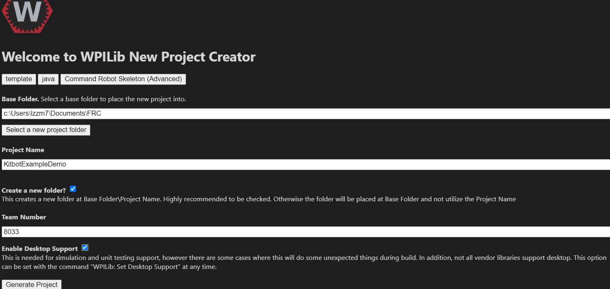
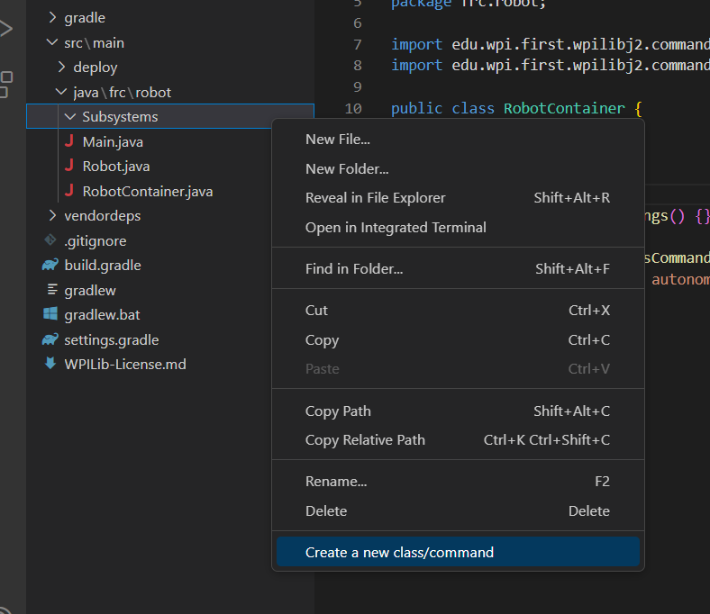

# Kitbot Code Tutorial

## Intro

### What is a kitbot?


The kitbot is a drivetrain which comes in the Kit of Parts provided by FIRST as part of registration.
It is a typical of example of a type of drivetrain known as a differential drive.
That name comes from the fact that the amount it turns is equal to the difference between the speed of the left and right sides.
This type of drive is also known as skid-steer or tank drive.

### Why kitbot?

We do not use the kitbot or other differential drive for our robots in competition.
Instead we use a much more versatile swerve drive.
However the code for a swerve drive is much more complex than a tank drive, which provides a good exercise to introduce you to programming FRC robots.
The kitbot has somewhat standard dimensions, gearboxes, wheels, and other physical characteristics so it makes for a consistent mechanism to start with.

### So what do we need to program?

Inputs/Outputs:

- A command that takes in velocity and rotational velocity, and outputs the correct wheel speeds to meet that.

Electronics:

- Each side of the chassis has two Falcon 500 motors, which will work together to power the left and right sides of the chassis.
In code this will look like a total of 4 Talon FX motor controllers, since thats the component we can talk to.

## Code Walkthrough

If you think you can figure out how to program this on your own, go for it!
However, check your work against this to see if you did it the same way.
If you have any questions about why we did it this way, ask a lead.

To start, open up WPILib vscode and create a new project.


Select `Template`, `Java`, `Command Robot Skeleton (Advanced)` as the template for your project.
Select whichever folder you want and title the project something along the lines of "Kitbot Example".
Set the team to 8033.
Make sure to enable desktop support, since it's necessary for simulation work which we will do on this project down the line.



Once you've created your project, open the src\main\java\frc\robot folder.
In this folder, create a new folder "Subsystems".


In that folder, right click and then click "create a new class/command"



Select Subsystem and name it DrivetrainSubsystem. This file is the subsystem file for the kitbot drivetrain.
It will contain all of the hardware that the drivetrain uses, in this case TalonFX motor controllers.
Other subsystems will contain sensors, solenoids, and more.
It will also contain methods that we use to interact with the subsystem from the rest of our code.

Our team names subsystem files using the NameSubsystem convention.
That means that our file should end in Subsystem, so it's clear what it is.
This will become more important later when we add AdvantageKit into our code.
The name should also be reasonably short and descriptive.
`IntakeSubsystem` is a good name.
`GreybotsGrabberSubsystem` is too long, and `CircleThingySubsystem` is not specific.

In this subsystem file we will need to add our hardware.
But to have access to the API for our motors, we need to install the CTRE Phoenix library.
Use the instructions [here](https://pro.docs.ctr-electronics.com/en/stable/docs/installation/pro-installation.html) to install the API.
Make sure to get the pro or v6 api.
For this project you may use the online installer, but if you want to use your computer to run and setup the robot it is useful to have Tuner X installed.

Once you have installed the vendor library, create two TalonFX objects in your subsystem called `leftFalcon` and `rightFalcon`.
By convention, hardware should have a succinct, descriptive name followed by the type of hardware it is.

```Java
TalonFX leftFalcon = new TalonFX(0);
TalonFX rightFalcon = new TalonFX(0);

/** Creates a new Drivetrain. */
public DrivetrainSubsystem() {}
```

The number being passed into the constructor for the TalonFXs is the ID number of the motor, which we set using Tuner.
Since we don't have real hardware for this example this number is arbitrary, but it's good practice to have a separate configuration file to store these sorts of constants.
Create a new file in the robot folder (where Robot.java and RobotContainer.java are) called Constants.
You can use the "create a new class or command" option and select "Empty Class" to speed this up.

In Constants.java add two `public static final int`s, one for the left motor's ID and one for the right motor.
By putting these configuration values all in one place we can easily change them if hardware changes.

```Java
public class Constants {
    public static final int drivetrainLeftFalconID = 0;
    public static final int drivetrainRightFalconID = 1;
}
```

Then change DrivetrainSubsystem to use the new constants.

Next, lets add the `ControlRequest` objects.
In CTREs v6/pro api, we set the output of a motor by passing it a subclass of `ControlRequest` like `VoltageOut` or `PositionDutyCycle`.
Below the Talons, add two `VoltageOut`s.

```Java
TalonFX leftFalcon = new TalonFX(Constants.drivetrainLeftFalconID);
TalonFX rightFalcon = new TalonFX(Constants.drivetrainRightFalconID);

VoltageOut leftVoltage = new VoltageOut(0);
VoltageOut rightVoltage = new VoltageOut(0);

/** Creates a new Drivetrain. */
public DrivetrainSubsystem() {}
```

We have the control requests now, but we need a way to set them.
Lets add a method for this.

```Java
private void setVoltages(double left, double right) {
    leftFalcon.setControl(leftVoltage.withOutput(left));
    rightFalcon.setControl(rightVoltage.withOutput(left));
}
```

You might notice that this method is private.
This is because whenever we want to interact with the hardware of a subsystem we should go through a Command, which guarantees that each piece of hardware is only requested to do one thing at a time.
To do this we need to make a Command factory method, or a method that returns `CommandBase`.

```Java
public CommandBase setVoltagesCommand(DoubleSupplier left, DoubleSupplier right) {
    return new RunCommand(() -> this.setVoltages(left.getAsDouble(), right.getAsDouble()), this);
}
```

Notice how instead of passing in `double`s we pass in `DoubleSupplier`s.
A `DoubleSupplier` is just any function that returns a `double`.
This function can always return the same value, effectively acting like a double, or it can get its value some other way.
This lets us use this command to drive the robot with joysticks, an autonomous controller, or other input.

In the body of the method we return a `RunCommand`.
`RunCommand` is a subtype of CommandBase, and represents a Command which runs a single function over and over again.
This function is defined using lambda syntax, or the `() ->` symbol.
On the right of the arrow is a call to our `setVoltages()` method, which checks our `DoubleSuppliers` for their value each call of the function, in this case every 20ms as part of the Command loop.

We might not want to drive the robot just by setting the left and right wheel speeds, however.
Lets add a method that uses a desired forwards/backwards and turning velocity to set the wheel speeds.
We can do this using WPILib's `DifferentialDrive` class.

```Java
public CommandBase setVoltagesArcadeCommand(DoubleSupplier drive, DoubleSupplier steer) {
    return new RunCommand(() -> {
      var speeds = DifferentialDrive.arcadeDriveIK(drive.getAsDouble(), steer.getAsDouble(), false);
      this.setVoltages(speeds.left * 12, speeds.right * 12);
    }, this);
}
```

This method is named `setVoltagesArcadeCommand` after the arcade drive inverse kinematics (IK) it uses, but other types of IK can also work.
On a real robot what we use would come down to driver preference.
In the method itself we have a very similar structure to the previous method.
The main difference is that instead of having one method in our lambda (`() ->`), we have a code block ({} block).
This means we need to end each line with a ; but can use multiple lines in our Command.
In this case we call arcadeDriveIK from WPILib's `DifferentialDrive` class and store the result in a variable called `speeds`.
Then we pass speeds to the drive method, multiplying by 12 to convert from the -1..1 units from the IK method to voltage.

These methods are all well and good on their own, but it would be nice if we had a way to actually use them.
Lets bind them to a joystick.
Go to RobotContainer.java and add a `CommandXboxController` object.

```Java
CommandXboxController controller = new CommandXboxController(0);
```

`CommandXboxController` is a convenience wrapper around a `XboxController` that makes it easy to bind commands to buttons on the controller.
We also need to add an instance of the `DrivetrainSubsystem` to RobotContainer so that we can control it.

```Java
CommandXboxController controller = new CommandXboxController(0);

DrivetrainSubsystem drivetrainSubsystem = new DrivetrainSubsystem();
```

Finally we can bind the arcade drive command to the joysticks.
To do this call `setDefaultCommand()` on `drivetrainSubsystem` in RobotContainer's `configureBindings()` method.
This sets a Command that will be run when no other command is using the drivetrain.
Pass in `drivetrainSubsystem.setVoltagesArcadeCommand()` as the default Command.

For the `DoubleSuppliers` to the arcade drive command we can add two lambdas that call `getLeftY()` and `getRightX()` on the controller, which looks at the current joysick values.
This means that each loop this command is run, it will check the current joystick values and turn them into voltages for the wheels.

This line is a little long now, so break it up into a few lines to keep it readable.

```Java
drivetrainSubsystem.setDefaultCommand(
    drivetrainSubsystem.setVoltagesArcadeCommand(
        () -> controller.getLeftY(), 
        () -> controller.getRightX()));
```

Using the joystick values directly is perfectly fine, but sometimes our driver wants a different feel to the controls.
One common way is to square the inputs to the drivetrain, which reduces the sensitivity of the drivebase at low speeds.
Another is to add a "deadband" where we wont output any voltage if the input is less than some threshold.
This stops the robot from moving if the controllers don't perfectly read 0 when they aren't pressed.
Lets add a function in RobotContainer to modify the joystick inputs.

Create a function that takes in a double and returns a double called `modifyJoystick`.
Lets start by adding the squaring of the input.
To do this we multiply our input by itself, but in the process we lose the sign of the input.
We can use `Math.signum` to add it back in.

```Java
private double modifyJoystick(double in) {
    return in * in * Math.signum(in);
}
```

Then lets add the deadband.
If the absolute value of `in` is less than 0.05 (as an example) then return 0.

```Java
private double modifyJoystick(double in) {
    if (Math.abs(in) < 0.05) {
      return 0;
    }
    return in * in * Math.signum(in);
}
```

Now we can add this method into our drive command.

```Java
drivetrainSubsystem.setDefaultCommand(
      drivetrainSubsystem.setVoltagesArcadeCommand(
        () -> modifyJoystick(controller.getLeftY()), 
        () -> modifyJoystick(controller.getRightX())));
```

Congratulations!
This code is everything you need for a basic kitbot to drive with arcade controls.
There are plenty of improvements that can be made to this program, such as adding autonomous control or closed loop driving.
Several of those changes you will make to this program over the next couple of courses.
