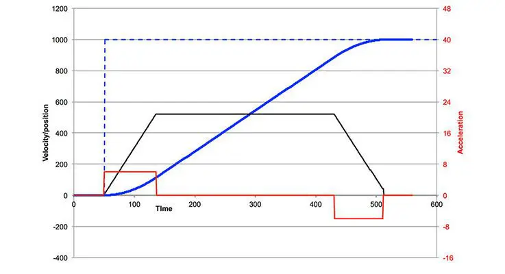

# Motion Profiles

## Motion Profiles are a way to smoothly control a mechanism by combining PID and FF control

As the [feedforward](Feedforward.md) article covered, it is often beneficial to combine feedforward and feedback (for our use, usually PID) control.
One problem with this is that a feedforward for a dc motor (such as a falcon 500) controls *velocity* while a mechanism might require *position* control.
A motion profile smoothly interpolates, or transitions between, between a starting position and a setpoint position.
There are a variety of types of motion profiles, but the one we use most often is called a *trapezoidal motion profile*.
When using a trapezoidal motion profile, a mechanism will attempt to accelerate at a constant rate to some cruising speed, then deaccelerate to a standstill at the setpoint position.

This graph shows a motion profile over time, although the specific values aren't important.
The blue line is the position of the controller, the black line is the velocity of the controller and the red line is acceleration.
You can see the 3 phases of the profile, with an accelerating phase at the start, a cruising phase through most of the profile, and a deaccelerating phase at the end.
The position line smoothly starts and stops, resulting in clean movement of the mechanism which minimizes wasted effort.
The real advantage of this is that now we have both a position and velocity setpoint at any given time, which means that the PID controller can adjust for disturbances in position while the feedforward controller can provide the majority of the control effort to get to the setpoint.

### Resources

- [What is a motion profile?](https://www.motioncontroltips.com/what-is-a-motion-profile/)
- [WPILib TrapezoidProfile docs](https://docs.wpilib.org/en/stable/docs/software/advanced-controls/controllers/trapezoidal-profiles.html)
- [WPILib ProfiledPIDController docs](https://docs.wpilib.org/en/stable/docs/software/advanced-controls/controllers/profiled-pidcontroller.html)

### Examples

- Our 2023 elevator uses motion profiling.

### Exercises

- Add a simulated elevator to your kitbot example code using WPILibs ElevatorSim class, and control it using a ProfiledPIDController and ElevatorFeedforward.

### Notes

- Motion profiling is primarily used for position-controlled mechanisms like elevators and arms.
It can also be used on velocity controlled mechanisms, although it provides less of a benefit.
- The `motion magic` control mode for a talon fx is really just running motion profiling on the motor controller.
