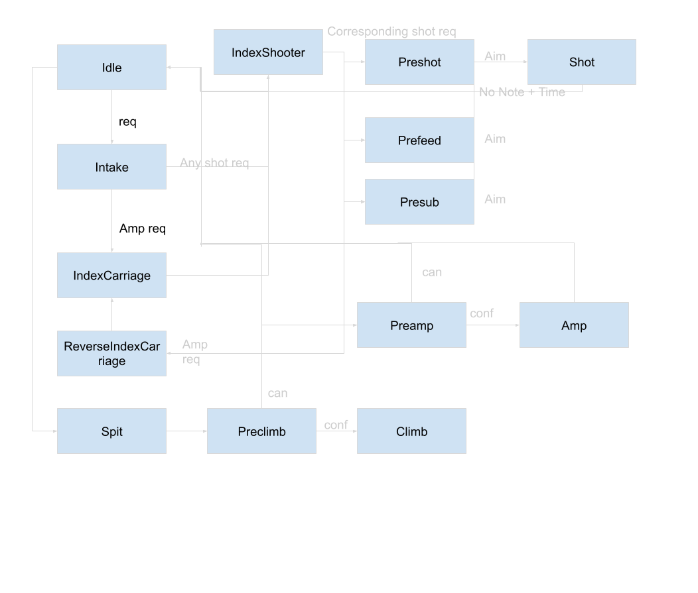
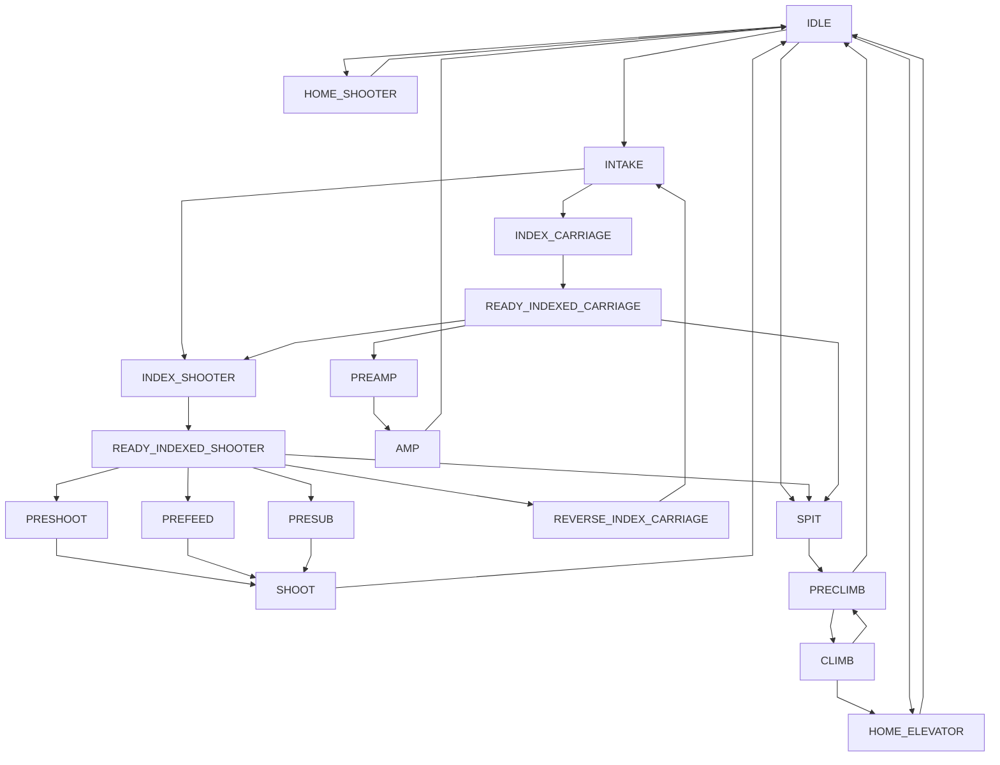

# Use of a Trigger and State Machine Backed Superstructure File for Subsystem Coordination

Lewis Seiden, 2024 Crescendo Offseason

## Abstract

This project is a [refactor of 8033s 2024 codebase](https://github.com/HighlanderRobotics/Crescendo/tree/superstructure-subsystem) to use an explicit finite state machine to control subsystems rather than simple Commands.
This refactor would help with approaching the codebase and organizing behavior, but would add some amount of boilerplate and a monolithic file.

## Procedure and Findings

I started on this project after seeing [2974's](https://github.com/WaltonRobotics/Crescendo/blob/main/src/main/java/frc/robot/subsystems/Superstructure.java) and [5940's](https://github.com/BREAD5940/2024-Onseason/blob/main/src/main/java/frc/robot/subsystems/Superstructure.Java) code, and wondering if using explicitly defined states could help manage our code.
These teams had a superstructure file which coordinated several subsystems based on a state machine.
This allowed for complex control flow with less places for confusion.

5940's Superstructure takes the form of a single subsystem with several IO layers in it.
This subsystem handled their elevator, pivot, and feeder for their 2024 robot.
These mechanical systems worked in concert and required some compensation based on the state of each of the others, so having them tightly coupled in one subsystem makes sense.

To request behavior the class has a number of boolean members, like `requestHome`.
The current state of the class is tracked, and passed through a massive if-else block.
Requests are used to manage state transitions, and IO outputs are set through the block.

This has some advantages, its simple and easy to understand.
It clearly encapsulates several IO objects in a subsystem.
However it is limited to fully encapsulating everything in a subsystem, and doesn't address the problem of wanting additional layers on top of subsystem.
It also invites bugs with a large managed if-else block and no hardware mutexing within the superstructure.

2974's superstructure file is not a subsystem.
Instead, it takes in several subsystems and maps *many* triggers to coordinate them.
They do not explicitly define states, instead they define command bindings using the many triggers defined in the file.

```Java
// An example binding
 (stateTrg_intake.and(trg_subwooferAngle.or(RobotModeTriggers.autonomous()).and(trg_straightThroughReq.negate())))
            .onTrue(
                Commands.parallel(m_intake.fullPower(), m_conveyor.startSlower())
            );
```

This setup is more flexible and easier to integrate with existing command based code, as well as demonstrating the power of Triggers.

However, it requires setting up a *lot* of triggers and doesn't explicitly define states as clearly as 5940.

To this end, I combine the two approaches by explicitly defining a state machine with a Trigger on each state.
By using a Trigger for each state, we can easily integrate with existing Subsystems.
By using an explicit state machine, it clearly structures the codebase.

Because of our highly integrated robot architecture for Banshee, all non-swerve subsystems were integrated in the superstructure.
This includes the intake, carriage, feeder, pivot, both flywheels, and elevator.
I also split the shooter into flywheels and the pivot for cleanliness.

To set up the superstructure, I wrote out all the states that the robot would be in and the edges between them.
This is the original state machine I worked from.



And this is a cleaned up version from the final code.



The current state (and previous state) is stored in an enum member of the superstructure.
A HashMap of state -> Trigger bindings is created, and each Trigger is setup up to have a set of commands including a call to `setState` which advances through the graph.
`setState` is called through the use of Trigger composition with `.and`.
An example of one of these bindings is bellow.

```Java
stateTriggers
        .get(SuperState.INTAKE)
        .whileTrue(intake.intake())
        .onFalse(intake.stop())
        .whileTrue(carriage.setVoltageCmd(CarriageSubsystem.INDEXING_VOLTAGE))
        // State Transition
        .and(carriage.beambreakTrig.or(feeder.beambreakTrig))
        .onTrue(
            this.setState(
                target.get().isSpeakerAlike()
                    ? SuperState.INDEX_SHOOTER
                    : SuperState.INDEX_CARRIAGE));
```

The binding starts with a call to get the Trigger from the map of state Triggers.
Then we bind the commands that run while that state is active (ie which subsystems have non-default behavior).
This includes running the intake and spinning the carriage indexing wheels.
Then we `.and` on another Trigger to check if either beambreak sees something.
If they do, we run a Command to move to the next state in the graph.
This state is a bit of a special case because of its branching behavior here.

This setup is a simple way to declare the mechanism states for each robot state, and how the robot states transition between each other.
In my opinion, it is relatively readable if somewhat verbose.
I wrote each command as being triggered by a separate `.whileTrue` clause, but this makes sequences within states more difficult to write when multiple subsystems may need to coordinate with each other, forcing the state graph to grow larger.
In the future, I would likely use Command groups instead.

Inputs to the superstructure are handled by several member Triggers, called "requests", of the superstructure such as `intakeRequest`.
These make it easy to bind default bindings, but make it hard to request states from other commands such as autos.
To remedy this, some requests had an additional boolean member request which could be set by a Command factory in the superstructure.
This boolean would be `.or`ed onto the existing Trigger, and the Command would be called from autos to request needed states.
This was a somewhat hacky workaround, and in the future going all Trigger or all boolean + Command bindings is likely optimal.

## Conclusion

This pattern is a useful tool to have for programming.
It provides a way to make "supersystems" on the robot that coordinate while still maintaining separate mutexes for their components.
The system is somewhat clunky when applied to a whole robot, especially for smaller states like "Home Elevator".
The process of writing out a full robot state machine was helpful to conceptualize what the robot needed to do and would be helpful to organize code whether or not the superstructure pattern is used.
